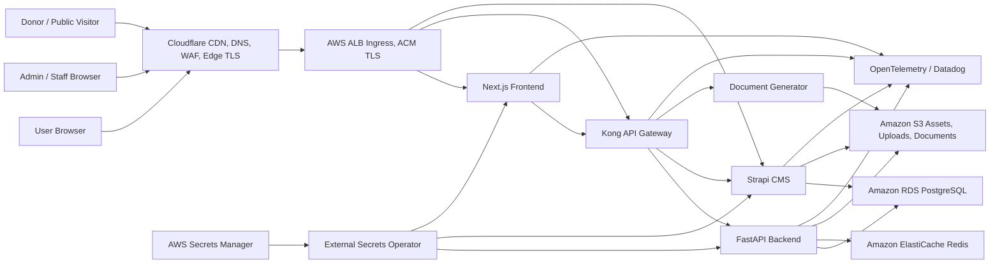

# Raushni SaaS System Design

This document describes the target production architecture for the Raushni SaaS platform, including CDN, edge TLS, Kong/API gateway, Kubernetes workloads, data services, observability, and operational boundaries.

## Goals

- Serve the public website, dashboard, CMS, and APIs securely on `raushni.com`.
- Support a shared SaaS model with tenant-aware application data and optional tenant subdomains.
- Keep public traffic behind Cloudflare CDN/WAF and AWS-managed TLS.
- Centralize API routing, authentication enforcement, rate limiting, and observability at Kong.
- Keep data services private and reachable only from Kubernetes workloads.
- Preserve a clear future path to tenant isolation by namespace or database.

## High-Level Architecture



## Edge and CDN

Cloudflare is the public edge for all browser-facing traffic.

| Host | Cloudflare role | Origin target | Notes |
| --- | --- | --- | --- |
| `raushni.com` | CDN, WAF, TLS, bot/rate controls | AWS ALB | Public app and website. |
| `www.raushni.com` | Redirect or CDN | AWS ALB | Prefer redirect to apex unless SEO requires both. |
| `api.raushni.com` | WAF, TLS, API abuse controls | AWS ALB -> Kong | Public API entry point. |
| `cms.raushni.com` | TLS, limited WAF | AWS ALB -> Strapi or Kong | Keep DNS-only during admin/upload troubleshooting. |
| `*.raushni.com` | Optional tenant subdomains | AWS ALB | Requires wildcard DNS and ACM SAN. |

Cloudflare baseline:

- SSL/TLS mode: `Full (strict)`.
- Always Use HTTPS: enabled.
- Automatic HTTPS Rewrites: enabled.
- Minimum TLS: `TLS 1.2`.
- DNS records must point to the public ALB hostname, never private IPs such as `192.168.x.x`.
- Cache static website assets aggressively.
- Bypass cache for authenticated dashboard, API, CMS admin, uploads requiring authorization, and payment/webhook routes.

Recommended cache policy:

| Path | Cache behavior |
| --- | --- |
| `/_next/static/*` | Cache, long TTL, immutable. |
| `/assets/*` | Cache, long TTL if content-hashed. |
| `/uploads/public/*` | Cache if public and immutable. |
| `/api/*` | Bypass cache. |
| `/api/auth/*` | Bypass cache. |
| `/api/webhook/*` | Bypass cache, strict WAF exception for payment provider IPs if available. |
| `/admin*` | Bypass cache. |

## AWS Entry Layer

AWS ALB is the Kubernetes ingress entry point.

- Terminate origin TLS with AWS ACM certificates for `raushni.com`, `www.raushni.com`, `api.raushni.com`, `cms.raushni.com`, and `*.raushni.com`.
- Redirect HTTP to HTTPS at the ALB.
- Route website traffic to the frontend service.
- Route API traffic to Kong.
- Keep health checks simple and unauthenticated.
- Restrict ALB security groups where practical to Cloudflare IP ranges, with an emergency break-glass rule for direct operator testing.

## Kong API Gateway

Kong should sit inside EKS behind the ALB and in front of API services. Kong becomes the main policy and routing layer for API traffic, while Cloudflare remains the internet edge.

Primary responsibilities:

- Route `/api/*` to the FastAPI backend.
- Route service-specific internal paths to Strapi and the document generator when needed.
- Enforce request size limits and timeouts.
- Apply API rate limits by route, tenant, user, or token.
- Validate authentication tokens for protected APIs.
- Add request correlation IDs and forward trace headers.
- Emit access logs, latency metrics, upstream error rates, and gateway status metrics.

Suggested public route model:

| Public path | Kong upstream | Policy |
| --- | --- | --- |
| `/api/auth/*` | frontend or backend auth handlers | Strict no-cache, low rate limit, bot protection. |
| `/api/v1/*` | backend | JWT/session validation except public endpoints. |
| `/api/cms/*` | Strapi | Read-only public content routes where possible. |
| `/api/documents/*` | document generator | Auth required, size/time limits. |
| `/api/webhook/*` | backend webhook handlers | Signature validation in app, WAF allow rules for provider IPs. |

Suggested Kong plugins:

- `request-id` for correlation.
- `rate-limiting` or `rate-limiting-advanced` for public and auth-heavy routes.
- `cors` with explicit allowed origins.
- `jwt` or OIDC plugin if token validation is moved to gateway.
- `prometheus` for metrics.
- `file-log`, `http-log`, or OpenTelemetry plugin for gateway telemetry.
- `acl` or consumer groups for tenant-level API products.

Use Kong declarative configuration or Kubernetes CRDs through Kong Ingress Controller. For this codebase, Kubernetes CRDs are the better fit because service ownership already lives in `k8s/`.

## Kubernetes Workloads

Production runs in the `raushni` namespace on EKS.

| Workload | Purpose | Public exposure |
| --- | --- | --- |
| `frontend` | Next.js public website and dashboard | ALB direct for pages, optional API auth routes. |
| `backend` | FastAPI application API | Through Kong only. |
| `strapi` | CMS content and admin | Through Kong or restricted ALB route. |
| `document-generator` | PDF and document rendering | Through Kong/internal only. |
| `kong` | API gateway and API policy enforcement | ALB route for API hosts/paths. |
| `otel-collector` | Telemetry collection | Internal only. |
| `datadog-agent` | Metrics/logs/APM | Internal only. |

Baseline controls:

- Readiness and liveness probes for every service.
- HPA for frontend, backend, CMS, Kong, and document generator.
- Pod disruption budgets for production workloads.
- Network policies so public ingress reaches only frontend, Kong, and explicitly exposed CMS routes.
- Service accounts scoped per workload.
- Secrets sourced from AWS Secrets Manager through External Secrets Operator.

## Data and Storage

| Service | Use |
| --- | --- |
| RDS PostgreSQL | Application records, tenant data, CMS records. |
| ElastiCache Redis | Sessions, cache, background coordination, rate-limiting backend if needed. |
| S3 | Strapi media uploads, generated documents, exports, backups. |
| AWS Secrets Manager | Runtime secrets consumed by External Secrets Operator. |
| ECR | Immutable container images. |

Tenant model:

- Start with shared database tables containing organization/tenant identifiers.
- Enforce tenant scoping in backend services and database queries.
- Include tenant ID in audit logs and request context.
- Future enterprise isolation path: namespace-per-tenant, database-per-tenant, or dedicated cluster for regulated customers.

## Security Model

Defense-in-depth layers:

1. Cloudflare: DNS, CDN, WAF, bot controls, edge TLS, DDoS protection.
2. AWS ALB: origin TLS, HTTP to HTTPS redirect, managed public ingress.
3. Kong: API auth policy, rate limiting, routing, request controls.
4. Application: authorization, tenant isolation, input validation, business rules.
5. Kubernetes: network policies, service accounts, pod security, secrets isolation.
6. Data tier: private subnets, security groups, encryption at rest, database credentials in Secrets Manager.

Important rules:

- Do not expose backend, document generator, RDS, Redis, or internal telemetry services directly to the internet.
- Do not store production secrets in `.env` files or committed manifests.
- Payment webhooks must verify provider signatures in application code even if WAF rules exist.
- CMS admin should be protected with strong credentials and preferably Cloudflare access rules or IP restrictions.

## Observability

Every request should have a correlation ID from Cloudflare or Kong through the app logs.

Minimum dashboards:

- Cloudflare traffic, WAF events, cache ratio, 4xx/5xx rate.
- ALB target health, latency, 4xx/5xx.
- Kong route latency, upstream latency, gateway error rate, rate-limit rejections.
- Backend API latency, error rate, database latency.
- Frontend server errors and user-facing web vitals.
- RDS CPU, connections, storage, slow queries.
- Redis memory, evictions, connections.
- Kubernetes pod restarts, HPA scaling, node pressure.

Alert on:

- Cloudflare 525/526.
- ALB unhealthy targets.
- Kong 5xx spike or upstream timeout spike.
- Backend 5xx or database connection errors.
- RDS storage exhaustion and high connection usage.
- Redis evictions.
- Failed ExternalSecret sync.

## Deployment Flow

1. Build images for frontend, backend, CMS, document generator, and Kong customizations if any.
2. Push immutable tags to ECR.
3. Apply Terraform for AWS foundation.
4. Push runtime secrets to AWS Secrets Manager.
5. Install cluster add-ons: AWS Load Balancer Controller, External Secrets Operator, metrics server, observability stack, Kong Ingress Controller.
6. Render and apply the production Kustomize overlay.
7. Configure Cloudflare DNS to ALB and enable `Full (strict)` TLS.
8. Validate app, API, CMS, document generation, auth, webhooks, and observability.

## Failure Modes

| Symptom | Likely layer | First checks |
| --- | --- | --- |
| Cloudflare 525 | Origin TLS | ALB certificate ARN, Cloudflare `Full (strict)`, DNS target. |
| Cloudflare 526 | Origin certificate validation | ACM certificate SANs, expiration, hostname. |
| Cloudflare 522/524 | Origin reachability/timeout | ALB health, security group, Kong/backend latency. |
| API 404 | Gateway routing | Kong route/path, ALB rule, service name. |
| API 401/403 | Auth policy | Kong plugin config, app auth, CORS, session cookies. |
| CMS uploads fail | Size/time/CORS | Cloudflare cache bypass, ALB/Kong body limits, Strapi config. |
| Tenant data leak risk | App/data model | Tenant scoping tests, authorization checks, audit logs. |

## Target Network Flow

Website page request:

```text
Browser -> Cloudflare CDN/WAF -> AWS ALB -> frontend -> RDS/CMS/API as needed
```

API request:

```text
Browser -> Cloudflare WAF -> AWS ALB -> Kong -> backend -> RDS/Redis/S3
```

CMS content request:

```text
Browser -> Cloudflare -> AWS ALB -> Kong or Strapi -> RDS/S3
```

Document generation:

```text
Browser -> Cloudflare -> AWS ALB -> Kong -> backend -> document-generator -> S3
```

## Open Decisions

- Whether `cms.raushni.com` should route through Kong or remain an explicit ALB route with Cloudflare access controls.
- Whether Kong should validate JWT/session tokens immediately or start with routing, rate limiting, CORS, and observability only.
- Whether Cloudflare Workers should be used for redirects, tenant host normalization, or lightweight edge logic.
- Whether tenant uploads should use shared buckets with tenant prefixes or dedicated buckets for enterprise tiers.
